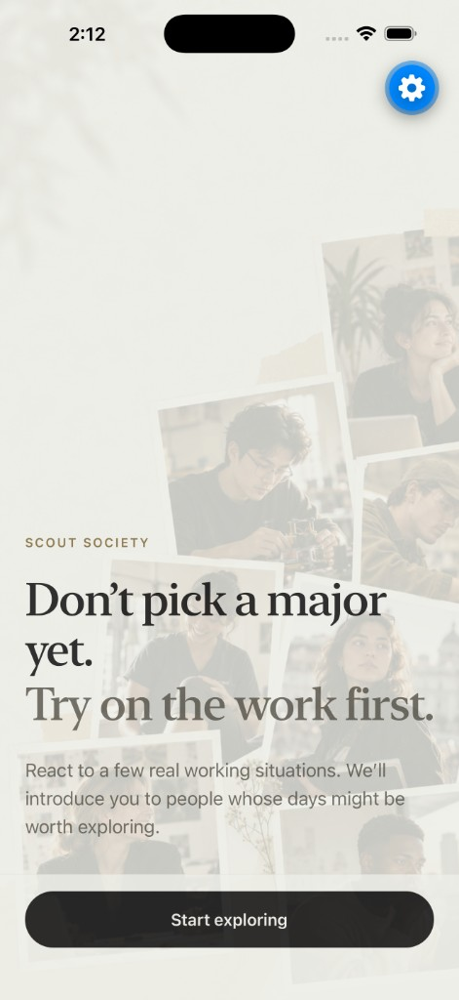
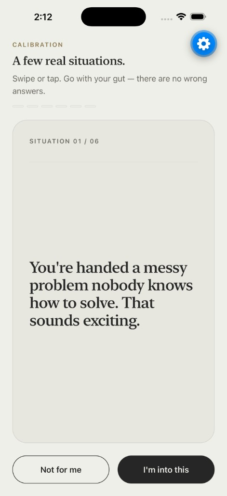
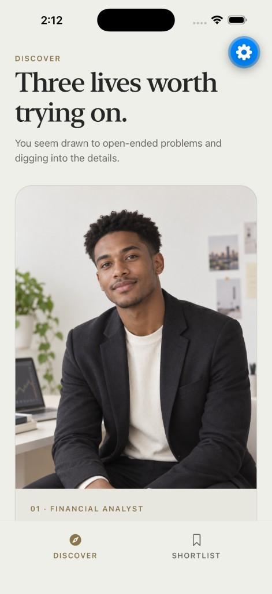
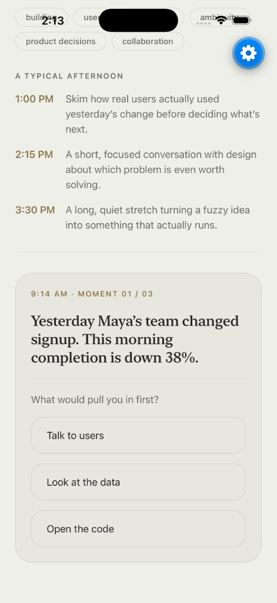
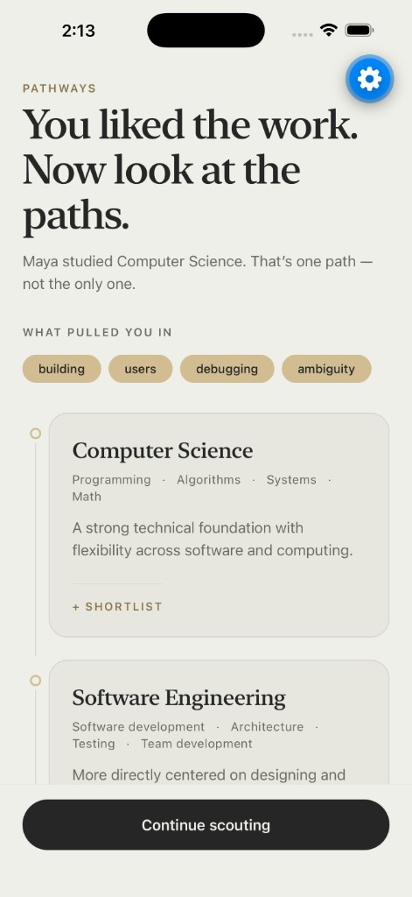
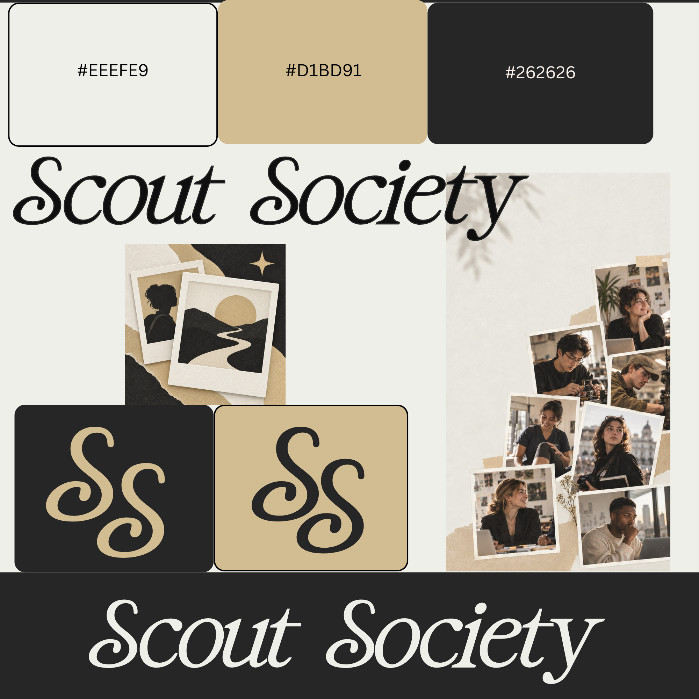

# Scout Society


Scout Society is a React Native + Expo prototype designed for an 18-year-old college freshman who is two months away from starting school and unsure what major to choose.

The core idea is:

> Don’t choose the major first. Experience the work first.

Scout Society helps students understand the kinds of working lives different majors can lead toward before asking them to make a high-stakes academic decision.

## Why This Product

Scout Society started from a simple observation:

When students are choosing a major, the most useful information is not always the course list.

One of the most valuable experiences I had as a college student was networking, talking with people in different fields, and asking what their actual day-to-day work looked like.

That gave me something a major description could not:

- what the work felt like
- what people actually did all day
- what surprised them about the role
- what parts of the job they liked or disliked
- what paths had led them there

That kind of exposure helped me think more clearly about what I wanted to study because I was no longer choosing only from academic labels. I was choosing with a better understanding of the kinds of working lives those paths could lead toward.

In conversations with other students, I found that this kind of real-world exposure and networking was consistently one of the most helpful ways to make career and major decisions.

That became the product insight behind Scout Society.

## Problem Statement

An 18-year-old freshman, two months before classes begin, may be asked to choose a major before they have enough exposure to understand what different careers actually feel like.

Traditional major-selection tools often start with:

- course catalogs
- aptitude quizzes
- personality questions
- career lists

Those approaches can be useful, but they still ask students to make decisions about work they may never have experienced.

The deeper problem is:

> How can a student choose what to study if they do not yet understand what the work on the other side might actually look like?

Scout Society addresses that by reversing the usual flow.

Instead of:

**Major → career**

Scout Society begins with:

**Work experience → people → reflection → possible majors**

## Why This Approach

The goal is not to tell a student:

> You should major in Computer Science.

The goal is to help them gather better evidence.

Scout Society lets students:

1. React to concrete work situations.
2. Discover people whose working lives may align with those reactions.
3. See what those jobs actually look and feel like.
4. Decide whether that kind of work still feels interesting.
5. Explore multiple majors that could lead toward similar work.

The recommendation is intentionally a starting point, not an answer.

This approach was chosen over a traditional major quiz because it is grounded in exposure rather than self-labeling.

A student may not know whether they are “analytical,” “creative,” or “people-oriented.”

They can usually react more meaningfully to:

> Would I want to spend three hours figuring out why one number does not make sense?

or:

> Would I enjoy helping someone make visible progress over several weeks?

That is the product strategy behind Scout Society:

> Don’t choose the major first. Experience the work first.

## Product Flow

1. **Calibrate**
   - React to six concrete work situations.
   - These are preference signals, not personality labels.

2. **Discover**
   - See three people whose working lives may be worth exploring.
   - Browse additional profiles outside the recommendations.

3. **Experience**
   - Open a professional profile and understand what their work actually feels like.
   - Maya, a Product Engineer, includes a deeper interactive “Tuesday” experience.

4. **React**
   - Mark a working life as “I’m into this” or “Not for me.”

5. **Explore Pathways**
   - See multiple majors that could lead toward similar kinds of work.
   - The product avoids treating any career as having one required major.

6. **Shortlist**
   - Save working lives and majors worth exploring further.

## Screens

A walkthrough of the core user flow, from intro to shortlist.

<table>
  <tr>
    <td width="33%" valign="top"><br /><sub><b>1. Intro</b> — Frame the idea: try on the work before choosing a major.</sub></td>
    <td width="33%" valign="top"><br /><sub><b>2. Calibrate</b> — React to six concrete work situations.</sub></td>
    <td width="33%" valign="top"><br /><sub><b>3. Discover</b> — Meet people whose working lives may be worth exploring.</sub></td>
  </tr>
  <tr>
    <td width="33%" valign="top"><br /><sub><b>4. Profile</b> — Understand what the work actually feels like.</sub></td>
    <td width="33%" valign="top"><br /><sub><b>5. Experience</b> — Step into Maya's Tuesday and make the calls she would face.</sub></td>
    <td width="33%" valign="top"><br /><sub><b>6. Pathways</b> — See multiple majors that could lead toward similar work.</sub></td>
  </tr>
  <tr>
    <td width="33%" valign="top"><br /><sub><b>7. Shortlist</b> — Save working lives and majors worth exploring further.</sub></td>
    <td width="33%"></td>
    <td width="33%"></td>
  </tr>
</table>

## Product Principle

A major is not a destination.

It is one possible path toward work you might want.

Scout Society is designed to help students build better evidence about themselves before making a high-stakes academic decision.

## Tech Stack

- React Native
- Expo
- TypeScript
- Expo Router
- React Native Reanimated
- Expo Image
- Local static data
- Local React state

This prototype intentionally avoids unnecessary production infrastructure such as authentication, databases, or a backend.

## Design Direction



Scout Society uses an editorial, human, premium visual language rather than a traditional education-dashboard aesthetic.

Brand palette:

- `#EEEFE9` — warm off-white
- `#D1BD91` — muted sand / gold
- `#262626` — near-black

The interface emphasizes:

- strong typography
- generous spacing
- editorial photography
- restrained motion
- minimal UI chrome
- warm, tactile visual details

## Running Locally

Install dependencies:

```bash
npm install
```

```bash
npx expo start
i
```
